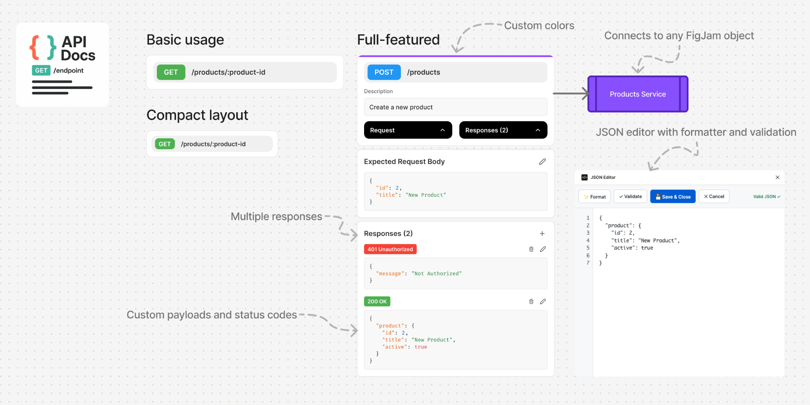

<p align="center">
    
    <h1 align="center">API Docs</h1>
</p>
<p align="center">
    A free, open-source Figma tool for documenting REST API endpoints directly in your design files.
</p>

<p align="center">
    
    
    
    
</p>

## Features

- **Custom API Endpoints** - Set any REST API path
- **Color-Coded Endpoints** - Set custom colors according to service or any other differentiation
- **Request & Response Bodies** - Document expected payloads
- **Multiple Status Codes** - 200 OK, 401 Unauthorized, etc.
- **Descriptions** - Add context and documentation
- **Works in Figma & FigJam** - Use in design files and whiteboards

## Screenshot



## Quick Start

1. Add API Docs to your Figma canvas
2. Click the HTTP method to change it
3. Set your API endpoint path
4. Add description and configure responses
5. Done! Share with your team

## Development

```bash
npm install
npm run watch    # Start development
npm run build    # Build for production
```

## License

MIT License - use freely in any project, commercial or personal. See [LICENSE](LICENSE) for details.

---

<p align="center">
    <strong>Made with ❤️ for the design and development community</strong>
</p>
